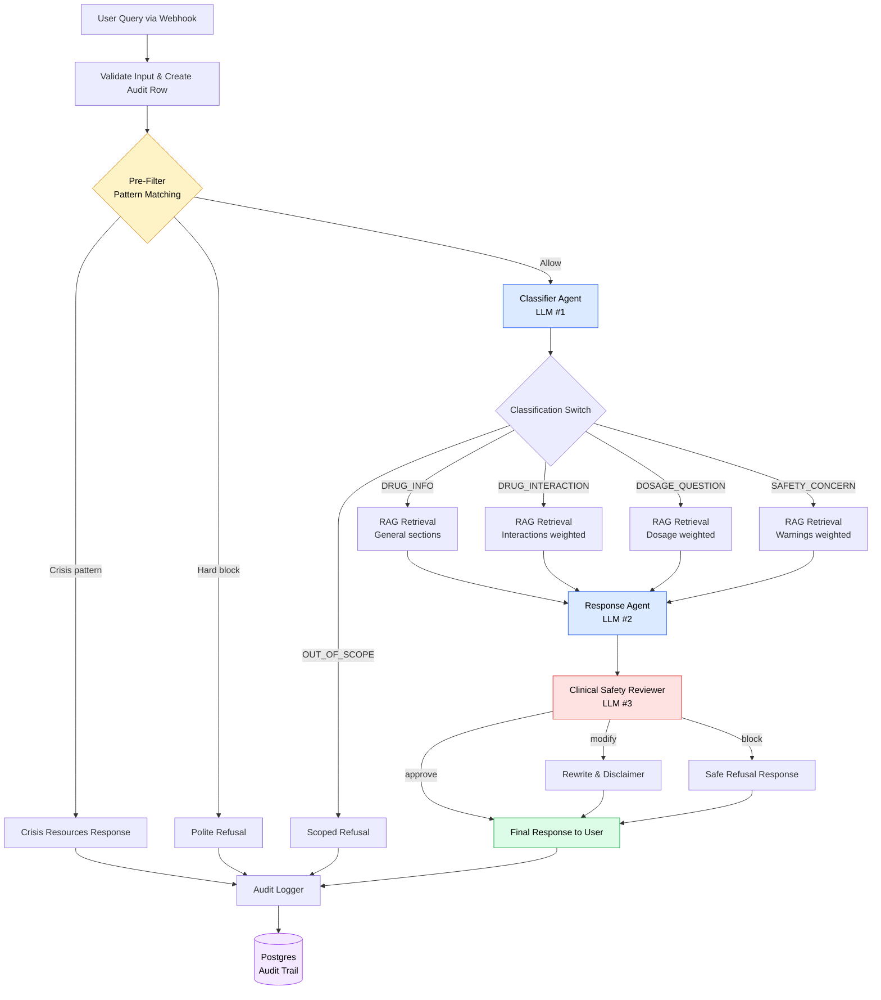

# Pharmacy Assistant — Multi-Agent AI System

[](https://n8n.io/)
[](https://cohere.com/)
[](https://www.postgresql.org/)
[](https://github.com/pgvector/pgvector)
[](https://www.docker.com/)
[](https://www.python.org/)
[](https://opensource.org/licenses/MIT)

A safety-first, multi-agent AI system that helps pharmacists and patients navigate medication questions through coordinated specialist agents, retrieval-augmented generation grounded in FDA drug labels, and a dedicated clinical safety reviewer that catches issues a single LLM would miss.

This is **not** another wrapper around a single LLM call. It is a defense-in-depth pipeline where the response generator, classifier, and safety reviewer are separate agents — each with a narrow job and the ability to override the others. In testing, the safety reviewer caught a response that recommended adult dosing for a pediatric query and rewrote it to refuse and redirect to a clinician. That is the architecture earning its complexity.

---

## Table of Contents

- [System Architecture](#system-architecture)
- [Key Features](#key-features)
- [Tech Stack](#tech-stack)
- [Local Setup & Installation](#local-setup--installation)
- [Safety Mechanisms](#safety-mechanisms)
- [Project Structure](#project-structure)
- [Example Queries](#example-queries)
- [License](#license)

---

## System Architecture

The system processes every user query through a defense-in-depth pipeline. Each stage has a distinct responsibility and can override the next one if necessary.



Every node in the pipeline writes to the audit trail, so any query's full journey can be reconstructed for debugging, quality monitoring, or compliance review.

---

## Key Features

### 🧭 Five-Way Query Classifier

An LLM-powered classifier routes every query into one of five categories: drug info, drug interaction, dosage question, safety concern, or out-of-scope. Each category triggers a different retrieval strategy and prompt template, so the system handles a casual "what's metformin for?" differently from "I just took two doses of warfarin." The classifier also extracts drug names (with synonym normalization for international names like paracetamol → acetaminophen) and assesses urgency on a three-level scale.

### 📚 Section-Aware RAG with Category-Specific Weighting

The knowledge base contains 3,724 chunks of FDA drug label content from 105 commonly prescribed medications, including drugs popular in Egypt (paracetamol, Augmentin, Buscopan, metronidazole). Chunks are not split blindly — they preserve clinical section boundaries and prepend section headers to every chunk, so retrieval naturally surfaces the right type of content. A dosage question retrieves heavily from `dosage_and_administration`; a safety query retrieves from `warnings_and_cautions` and `boxed_warning`. This is implemented through SQL-level section penalties applied during vector similarity search.

### 🛡️ Dedicated Clinical Safety Reviewer Agent

After the response agent drafts an answer, a separate LLM agent reviews it specifically for clinical safety issues — adult dosing in response to pediatric questions, missing contraindication mentions when patient context indicates risk, reassurance about dangerous interactions, fabricated information, diagnostic claims. The reviewer outputs `approve`, `modify`, or `block`. When it modifies, it rewrites the response or appends a disclaimer. When it blocks, the user gets a safe refusal instead of the unsafe original. **This is the layer that demonstrably catches problems the single response agent missed.**

### 📋 Full Audit Trail

Every step of every query — pre-filter verdict, classification details, retrieved sources, draft response, safety verdict, final response, latency, token usage — is logged to a Postgres table. A reusable `Audit_Logger` sub-workflow centralizes the logging logic so adding a new step requires updating one place, not every node.

### 🚨 Crisis & Harm Pattern Pre-Filter

Before any LLM is called, regex-based patterns catch self-harm indicators (route to crisis resources with Egyptian hotline numbers) and obvious harm queries (route to polite refusal). Crisis patterns are checked first — a query mentioning both self-harm and an overdose method goes to crisis support, not a refusal lecture. This layer is fast, free, and deterministic.

### 🌍 Multilingual Embedding Support

Cohere's `embed-multilingual-v3.0` powers retrieval, with native support for Arabic alongside English — relevant for the Egyptian deployment context where the system might receive Arabic queries.

---

## Tech Stack

| Component | Technology | Why This Choice |
|---|---|---|
| **Workflow Orchestration** | n8n (self-hosted) | Visual workflow editor; agent boundaries are explicit and inspectable; easier to debug and explain than imperative code |
| **LLM Provider** | Cohere `command-r-plus-08-2024` | Generous free tier; reliable structured JSON output (critical for classifier and safety reviewer); strong instruction-following |
| **Embeddings** | Cohere `embed-multilingual-v3.0` | 1024 dimensions; Arabic support; asymmetric query/document modes for better retrieval quality |
| **Vector Store** | pgvector (in Postgres 16) | Co-located with audit DB for transactional consistency; HNSW index for sub-100ms search; no extra service to operate |
| **Audit Database** | PostgreSQL 16 | Same instance as pgvector; one source of truth |
| **Knowledge Source** | OpenFDA Drug Labels API | Free; authoritative FDA-approved labels; pre-structured into clinical sections |
| **Container Runtime** | Docker Compose | Single-command stack startup; reproducible across environments |
| **Data Pipeline** | Python (download script) | One-shot ingestion of drug labels with retry logic and run logging |

---

## Local Setup & Installation

### Prerequisites

- Docker and Docker Compose installed
- Python 3.10+ (for the drug label downloader)
- A free [Cohere API key](https://dashboard.cohere.com/api-keys)
- ~5 GB free disk space (for the Docker volumes and drug label data)

### 1. Clone the Repository

```bash
git clone https://github.com/<your-username>/pharmacy-assistant.git
cd pharmacy-assistant
```

### 2. Configure Environment Variables

Copy the example file and fill in your secrets:

```bash
cp docker/.env.example docker/.env
```

Edit `.env` with your values:

```env
# n8n basic auth (use a strong password)
N8N_BASIC_AUTH_USER=admin
N8N_BASIC_AUTH_PASSWORD=<your-strong-password>

# n8n encryption key — generate one with: openssl rand -hex 32
N8N_ENCRYPTION_KEY=<32-byte-hex-string>

# Postgres
POSTGRES_PASSWORD=<your-strong-db-password>
```

> **Note:** Your Cohere API key is not stored in `.env`. It is added directly into n8n's credential manager in step 5.

### 3. Start the Docker Stack

```bash
cd docker
docker compose up -d
```

This brings up:
- **n8n** at `http://localhost:5678`
- **Postgres + pgvector** at `localhost:5433`

Verify both containers are healthy:

```bash
docker compose ps
```

### 4. Download the Drug Label Knowledge Base

The Python script fetches drug labels from OpenFDA. Run it once:

```bash
cd ..
pip install requests
python scripts/medicine-scrap.py
```

This populates `./docker/medical-docs/` with ~210 JSON files (105 drugs × label + metadata sidecar). The script has retry logic and logs progress; expect it to complete in 2-5 minutes.

### 5. Configure n8n

Open `http://localhost:5678` and complete the initial owner-account setup.

#### Add Credentials

Navigate to **Credentials → Add Credential** and configure:

**Postgres credential:**
- Type: Postgres
- Host: `pgvector` (the Docker service name)
- Database: `pharmacy_assistant`
- User: `pharmacy`
- Password: (from your `.env`)
- Port: `5432`
- SSL: Disable

**Cohere credential (for embeddings):**
- Type: Cohere API
- API key: your Cohere key

**Header Auth credential (for direct LLM calls):**
- Type: Header Auth
- Name: `Authorization`
- Value: `Bearer <your-cohere-api-key>`

#### Import the Workflows

In n8n, go to **Workflows → Import from File** and import all three:

1. `workflows/Audit_Logger.json` — logging sub-workflow
2. `workflows/Rag_Ingestion.json` — knowledge base ingestion
3. `workflows/Pharmacy_Assistant_Main.json` — main pipeline

For each workflow, open it and make sure the credential references resolve correctly (Postgres and Cohere credentials should be auto-linked by name, but verify).

### 6. Ingest the Knowledge Base

Open the `RAG_Ingestion` workflow in n8n and click **Execute Workflow**. This embeds all 3,724 chunks and inserts them into pgvector. Expect 5-10 minutes to complete.

Verify with:

```bash
docker exec -it pgvector psql -U pharmacy -d pharmacy_assistant -c "SELECT COUNT(*) FROM pharmacy_knowledge;"
```

Should return ~3,724.

### 7. Activate the Main Workflow

Open `Pharmacy_Assistant_Main` and toggle **Active** in the top-right. Now the production webhook URL is live:

```
http://localhost:5678/webhook/pharmacy-query
```

### 8. Test It

Send a test query with `curl`:

```bash
curl -X POST http://localhost:5678/webhook/pharmacy-query \
   -H "Content-Type: application/json" \
   -d '{
      "user_query": "What is metformin used for?",
      "user_context": {"age": 65, "role": "patient"}
   }'
```

You should receive a JSON response with `status: "completed"`, a prose `response`, source citations, and a safety verdict.

---

### 9. Connect the Streamlit UI (via Ngrok)

If you are hosting the Streamlit frontend (`app.py`) on Streamlit Community Cloud while keeping the n8n backend running locally via Docker, the cloud app cannot securely reach `localhost`. You must expose your local n8n instance to the internet using [Ngrok](https://ngrok.com/).

1. Download, install, and authenticate Ngrok on your local machine.
2. Open a new terminal and start a tunnel to your n8n port:
   ```bash
   ngrok http 5678

# Replace localhost with your active Ngrok URL
WEBHOOK_URL = "[https://partly-overcast-lilly.ngrok-free.dev/webhook/pharmacy-query](https://partly-overcast-lilly.ngrok-free.dev/webhook/pharmacy-query)"

---

## Safety Mechanisms

The system uses eight overlapping layers of defense. None alone is sufficient; together they ensure that multiple things must fail for a harmful answer to reach a user.

### Layer 1 — Regex Pre-Filter

Pattern matching catches obvious harm queries (lethal-dose questions, abuse facilitation) and self-harm indicators before any LLM is invoked. Fast, free, deterministic. Crisis patterns are evaluated before block patterns so distressed users are routed to support, not refused.

### Layer 2 — Classifier Routing

The LLM classifier identifies out-of-scope queries (prescription requests, diagnostic questions, jokes) and routes them to a scoped refusal that doesn't engage the rest of the pipeline. This catches intent-level issues that pattern matching cannot.

### Layer 3 — RAG Grounding

The response agent's prompt explicitly forbids using information not present in retrieved context. With low temperature (0.2), the LLM stays close to the retrieved sources and cannot hallucinate drug facts that aren't in the FDA labels.

### Layer 4 — Drug Name Normalization

A synonym dictionary maps international and brand names (paracetamol, Tylenol, salbutamol, Voltaren) to US generic names that match the database. Without this, an Egyptian user asking about *paracetamol* would hit zero results because the database stores *acetaminophen*.

### Layer 5 — Response Agent Hard Constraints

The response agent's system prompt enforces inviolable rules: never invent dosages, never recommend starting/stopping prescriptions, never make diagnostic claims, always recommend professional consultation for personalized decisions.

### Layer 6 — Hard-Coded Safety Overrides

For SAFETY_CONCERN queries specifically, the post-processing code forces `recommend_professional_consultation: true` regardless of what the LLM returned, defending against the model occasionally underestimating urgency.

### Layer 7 — Clinical Safety Reviewer Agent

A separate LLM reviews the draft response for clinical safety issues — adult dosing for pediatric queries, missing contraindication mentions when patient context indicates risk, reassurance about dangerous interactions. It can approve, rewrite, or block. **In testing, this layer caught a response that began with adult dosing for a pediatric paracetamol query and rewrote it to refuse and redirect to a pediatrician.**

### Layer 8 — Mandatory Disclaimer

Every successful response — even fully approved ones — includes a non-removable disclaimer reminding users that the system provides educational information only and is not a substitute for professional medical advice.

---

## Project Structure

```
pharmacy-assistant/
├── app.py                          # Streamlit UI
├── requirements.txt                # UI dependencies
├── .gitignore
├── docker/
│   ├── docker-compose.yml          # Stack definition (n8n + pgvector + UI)
│   ├── .env.example                # Template for secrets
│   ├── .env                        # Local secrets (not committed)
│   └── medical-docs/               # Downloaded drug labels
│       ├── metformin.json
│       ├── metformin.meta.json
│       └── ...
├── workflows/                      # Exported n8n workflow definitions
│   ├── Pharmacy_Assistant_Main.json
│   ├── Audit_Logger.json
│   └── Rag_Ingestion.json
├── scripts/
│   └── medicine-scrap.py           # OpenFDA label downloader

```

---

## Example Queries

The system handles five categories of queries with different routing and prompts:

```bash
# 1. DRUG_INFO — general drug information
curl -X POST http://localhost:5678/webhook/pharmacy-query \
   -H "Content-Type: application/json" \
   -d '{"user_query": "What is metformin used for?", "user_context": {"role": "patient"}}'

# 2. DRUG_INTERACTION — multi-drug queries
curl -X POST http://localhost:5678/webhook/pharmacy-query \
   -H "Content-Type: application/json" \
   -d '{"user_query": "Can I take ibuprofen with my lisinopril?", "user_context": {"age": 65, "role": "patient", "current_medications": ["lisinopril 10mg"]}}'

# 3. DOSAGE_QUESTION — caught by safety reviewer if poorly answered
curl -X POST http://localhost:5678/webhook/pharmacy-query \
   -H "Content-Type: application/json" \
   -d '{"user_query": "How much paracetamol can I give my 5-year-old child?", "user_context": {"role": "patient"}}'

# 4. SAFETY_CONCERN — urgent, escalates to professional consultation
curl -X POST http://localhost:5678/webhook/pharmacy-query \
   -H "Content-Type: application/json" \
   -d '{"user_query": "I accidentally took two doses of my warfarin this morning, what should I do?", "user_context": {"age": 70, "role": "patient", "current_medications": ["warfarin 5mg"]}}'

# 5. OUT_OF_SCOPE — declines outside its remit
curl -X POST http://localhost:5678/webhook/pharmacy-query \
   -H "Content-Type: application/json" \
   -d '{"user_query": "Can you prescribe me Xanax?", "user_context": {"role": "patient"}}'
```

## License

Released under the [MIT License](LICENSE). The drug label data sourced from OpenFDA is in the public domain.

---

## Acknowledgments

- **OpenFDA** for providing free, programmatic access to FDA-approved drug labels
- **Cohere** for the LLM and embedding infrastructure
- **n8n** for the workflow orchestration platform
- **pgvector** for making vector search a Postgres extension rather than a separate system

---
